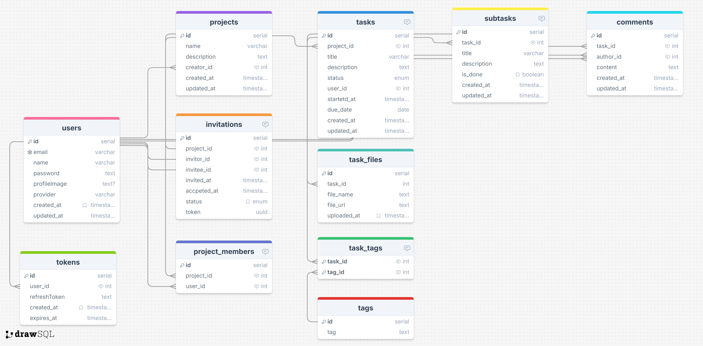

#  2팀 - MoonShot 프로젝트

📄 [2팀 프로젝트 계획서 보기](https://www.notion.so/2065c17d948680e984f1e73ea7c43d70)

---

## 👨‍👩‍👧‍👦 팀원 구성

| 이름     | GitHub 링크 |
|----------|-------------|
| 고민재   | [@nbkominjae](https://github.com/nbkominjae) |
| 김진솔   | [@JINSOLdev](https://github.com/JINSOLdev) |
| 하상준   | [@hippo8427](https://github.com/hippo8427) |
| 강시연   | [@singnyeo](https://github.com/singnyeo) |
| 차수연   | [@chya-chya](https://github.com/chya-chya) |

---

## 📌 프로젝트 소개

- **프로젝트 이름:** MoonShot  
- **프로젝트 주제:** 프로젝트 일정 관리 서비스 백엔드 시스템 구축  
- **진행 기간:** 2025.07.22 ~ 2025.08.13  

---

## 🛠️ 기술 스택

- **Backend:** Express.js, Prisma ORM  
- **Database:** PostgreSQL  
- **API 문서화:** Swagger  
- **협업 도구:** Git & GitHub, Discord  

---

## 🧩 팀원별 구현 기능

> 각자 개발한 기능에 대한 스크린샷, GIF, 설명 등을 첨부해주세요.

### 💻 고민재
- (구현 기능 요약)
- 

### 💻 김진솔
- (구현 기능 요약)
- 

### 💻 하상준
- (구현 기능 요약)
- 

### 💻 강시연
- (구현 기능 요약)
- 

### 💻 차수연
- (구현 기능 요약)
- 

---

## 📁 프로젝트 파일 구조
📦 프로젝트 루트
```
├── 📁 src
│   ├── 📁 config
│   │   └── db.ts
│   ├── 📁 controllers
│   │   ├── auth.controller.ts
│   │   └── user.controller.ts
│   ├── 📁 middleware
│   │   ├── auth.middleware.ts
│   │   └── error.middleware.ts
│   ├── 📁 routes
│   │   ├── auth.routes.ts
│   │   └── user.routes.ts
│   ├── 📁 services
│   │   ├── auth.service.ts
│   │   └── user.service.ts
│   ├── 📁 utils
│   ├── app.ts
│   └── server.ts
├── 📁 prisma
│   ├── schema.prisma
│   └── seed.ts
├── .env
├── .gitignore
├── package.json
├── tsconfig.json
└── README.md
```
---

## 🌐 구현 홈페이지

👉 [배포 링크 삽입 예정](#)

---

## 📊 ERD (Entity Relationship Diagram)

> ERD 이미지 삽입 예시



---

## 🧠 프로젝트 회고 및 발표자료

📎 [발표자료 다운로드](#)  
📎 [회고 링크 / Notion / PPT 등](#)

---


